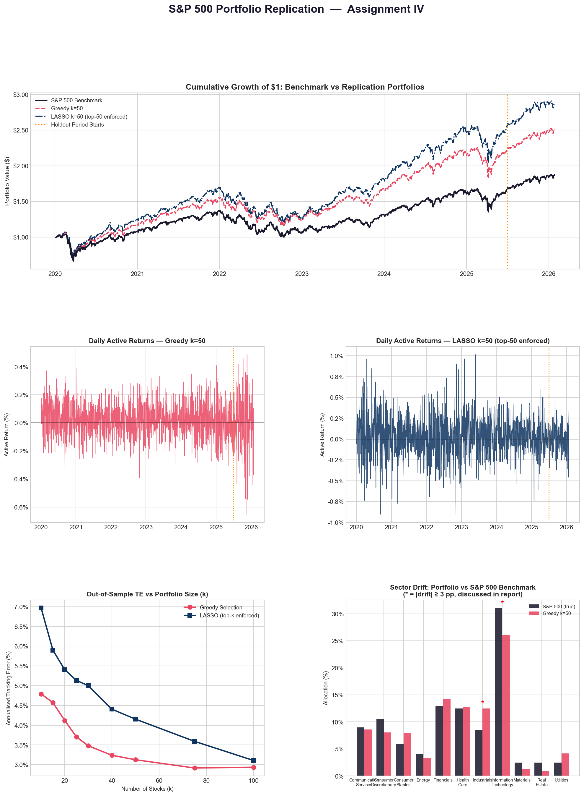

# S&P 500 Portfolio Replication: LASSO vs Greedy Selection
cardinality-constrained portfolio replication of the S&P 500 index using two different heuristic approaches to a problem that is exactly NP-hard if you try to solve it exactly.

## The problem

Selecting the best k=50 stocks out of the ~500 in the S&P 500 to minimize tracking error against the actual index is a mixed-integer quadratic program (MIQP) — choosing *which* subset and *how much weight* to put on each simultaneously. Exact MIQP solutions are computationally intractable at this scale, so two different heuristics were used instead:

1. **LASSO regression** — regress the index return on all ~500 constituent returns with an L1 penalty, which drives most coefficients to exactly zero. The top-k survivors by coefficient magnitude become the selected stocks (weights renormalized to sum to 1).
2. **Greedy forward selection + Quadratic Programming** — iteratively add whichever stock is most correlated with the current tracking residual, then once k stocks are picked, solve a convex QP for the long-only weights that minimize tracking variance on that fixed subset.

## Data

Daily OHLCV for S&P 500 constituents plus the index itself (`^GSPC`), Jan 2020 – Feb 2026, sourced per-ticker in `OHLCV_Data/Mega/`. Train: Jan 2020 – Jun 2025. Holdout: Jul 2025 onward — genuinely out-of-sample, not touched during model fitting.

## Results (k=50, out-of-sample holdout)

| Method | Train TE | Holdout TE | Train IR | Holdout IR |
|---|---|---|---|---|
| Greedy k=50 | 1.79% | 3.13% | 2.98 | 0.27 |
| LASSO (top-50 enforced) | 1.27% | 2.89% | 3.48 | -0.05 |

TE = annualized tracking error, IR = information ratio. Both methods track reasonably well in-sample and degrade out-of-sample — expected, since 50 stocks is a real constraint against a 500-stock benchmark, and any fixed selection will drift from the index's evolving composition over a 6+ year window.



The top panel is the most informative: both replication portfolios track the S&P 500's shape closely for most of the sample, including through the 2020 crash and the 2022 drawdown, and both end up ahead of the raw index in cumulative terms over this period (which reflects the selected subset's composition, not necessarily a reproducible "beat the market" signal — 50 hand-picked large caps outperforming a cap-weighted 500-stock index over one specific historical window isn't strong evidence of anything beyond that window).

## Sparsity trade-off

A useful piece of this analysis: tracking error as a function of how many stocks you're allowed to use (`k`), swept from 10 to 100.

Both curves show diminishing returns — most of the achievable tracking-error reduction happens by around k=40-50, after which adding more stocks barely helps. This is the practical argument for why 50 is a sensible cardinality choice, not an arbitrary one: it sits close to where the curve flattens for LASSO, and comfortably past the flattening point for Greedy.

Greedy actually tracks *tighter* than LASSO at every k in this sweep — but per the results table above, LASSO holds up somewhat better out-of-sample at k=50 specifically. That gap between "better in-sample fit" and "better out-of-sample generalization" is the more interesting finding here and worth digging into further (see below).

## Sector composition

The Greedy k=50 portfolio's sector weights vs the true S&P 500 sector weights:

| Sector | S&P 500 | Greedy k=50 |
|---|---|---|
| Information Technology | 31.0% | 25.3% |
| Financials | 13.0% | 9.8% |
| Health Care | 12.5% | 10.8% |
| Consumer Discretionary | 10.5% | 6.8% |
| Communication Services | 9.0% | 8.6% |
| Industrials | 8.5% | 7.6% |
| Consumer Staples | 6.0% | 7.9% |
| Utilities | 2.5% | 3.4% |
| Materials | 2.5% | 1.3% |
| Real Estate | 2.5% | 1.0% |
| Energy | 4.0% | 3.1% |
| Other (unmapped) | 0.0% | 14.5% |

The largest gap is IT being meaningfully underweight (25.3% vs 31.0%) even though it's still the single largest sector allocation — a sensible outcome for a variance-minimizing objective, since it wouldn't want to concentrate too heavily in one high-covariance sector even if that sector dominates the actual index. The 14.5% "Other" bucket reflects some selected tickers not being present in this version's sector map — worth cleaning up if this analysis is extended further.


## Repo structure

```
OHLCV_Data/Mega/            per-ticker daily OHLCV, ~500 S&P 500 constituents + ^GSPC
portfolio_replication.py     full pipeline: data loading, LASSO, Greedy+QP, evaluation, plotting
results/
  results.json
  metrics.csv
  sparsity_te.csv             TE vs k sweep, k=10 to 100
  sector_drift.csv
  greedy_weights.csv
  portfolio_replication_analysis.png
```

## Running it

```bash
pip install numpy pandas scikit-learn cvxpy matplotlib
python portfolio_replication.py
```
(Update `DATA_DIR` at the top of the script to point at your local `OHLCV_Data/Mega` path.)

